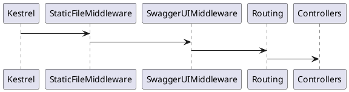
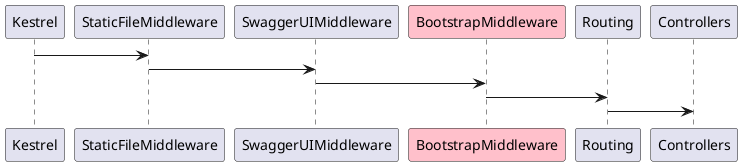

# Middleware

You can read about the middlewares [here](https://learn.microsoft.com/en-us/aspnet/core/fundamentals/middleware/?view=aspnetcore-8.0).

Bootstrap middleware will prevent API requests while the server is still initializing. 
Meaning, all requests that are handled down the request pipeline will be blocked.
Middleware will also set new headers and return its own response JSON.

More about the response headers and model can be found [here](Frontend.md).

So, let's break down the decision of where to place the middleware itself.

For example, you have 3 middlewares in total:

- `StaticFileMiddleware` (built-in middleware to serve static files)
- `SwaggerUIMiddleware` (SwaggerUI middleware to serve documentation)
- Routing/Endpoint middleware (built-in router to your controllers or minimal web APIs)



We care about protecting controllers from executing before the bootstrap actions are done.
So we can skip and put our middleware right before routing middleware like this:



That's how it looks in code:
```C#
app.UseStaticFiles();
app.UseSwaggerUI();
app.UseBootstrapMiddleware();
app.MapControllers();
```

In this configuration server will serve static files and Swagger documentation but controllers will be unavailable until the bootstrap is done.
